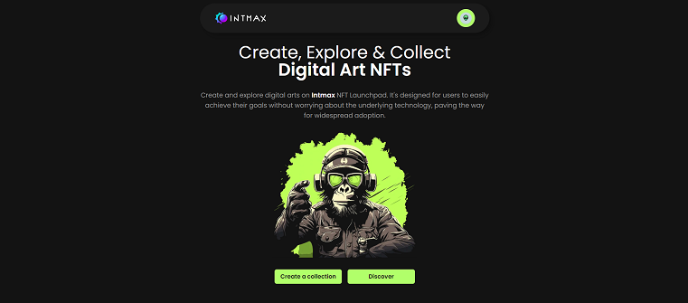
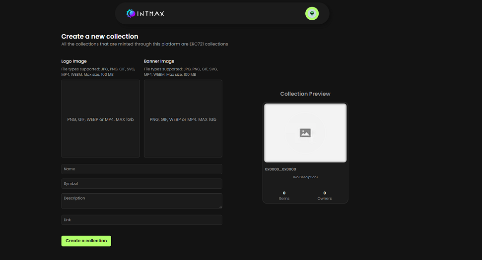

# NFT Issuance and Display Application


_Figure 1: NFT Issuance interface._


_Figure 2: NFT Display interface._

This project is a simple test application demonstrating the issuance and display of NFTs using the ERC721 standard. It is built with Next.js and integrates React Query and GraphQL to fetch and display data from a subgraph. The user interface is designed to be user-friendly and intuitive.

## Table of Contents

- [Features](#features)
- [Technologies Used](#technologies-used)
- [Installation](#installation)
- [Usage](#usage)
- [Project Structure](#project-structure)
- [Future Improvements](#future-improvements)
- [License](#license)

## Features

- **NFT Issuance**: Implement functionality to create new NFTs.
- **Display NFTs**: View the NFTs that have been created.
- **User Interface**: Design a user-friendly interface for the application.

## Technologies Used

- **Next.js**: React framework for building the user interface.
- **Solidity**: Smart contract language for the ERC721 implementation.
- **The Graph**: Indexing protocol for querying blockchain data.
- **React Query**: Data-fetching library for React.
- **GraphQL**: Query language for the API.

## Installation

1. Clone the repository:

   ```bash
   git clone https://github.com/infiniteaengus/intmax-nft-launchpad.git
   cd intmax-nft-launchpad
   ```

2. Install dependencies:

   ```bash
   npm install
   ```

3. Set up environment variables:
   Create a `.env.local` file and add your environment variables (e.g., The Graph API endpoint).

4. Deploy the subgraph:
   Follow the instructions in The Graph documentation to deploy your subgraph.

## Usage

1. Start the development server:

   ```bash
   npm run dev
   ```

2. Open your browser and navigate to `http://localhost:3000` to view the application.

## Project Structure

```plaintext
.
├── components
│   ├── NFTCard.tsx         			# Component to display a single NFT
│   ├── CollectionCard.tsx  			# Component to display a list of collections
│   └── ...                 			# Other components
├── app
│   ├── page.tsx            			# Home page
│   ├── create-collection/page.tsx      # Page to create new collections
│   ├── collection/page.tsx           	# Explore collections page
│   ├── collection/[id]/page.tsx        # Explore nfts page on certain collection
│   ├── collection/[id]/mint/page.tsx   # Mint nft page
├── lib/graphql
│   ├── queries.ts          			# GraphQL queries
│   └── ...                 			# Other GraphQL-related files
├── styles
│   ├── globals.css         			# Global CSS
│   └── ...                 			# Other styles
├── README.md
└── ...                     			# Other files
```
